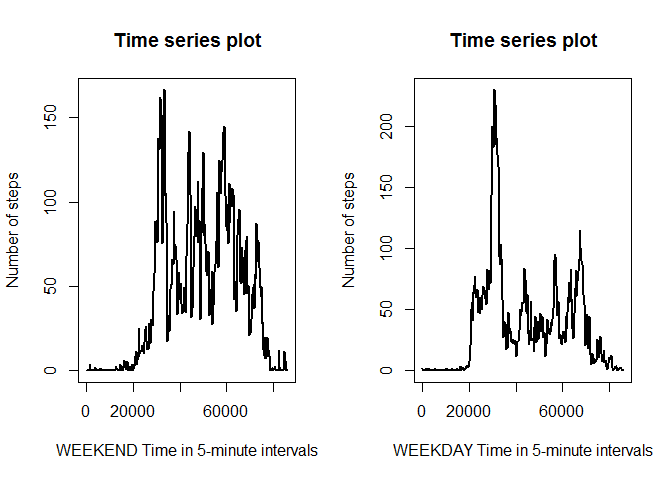

# Reproducible Research: Peer Assessment 1


## Loading and preprocessing the data

Data were loaded using the data.table framework into data table act using the fast fread command.

```r
library (data.table)
```

```
## Warning: package 'data.table' was built under R version 3.2.3
```

```r
library (ggplot2)
```

```
## Warning: package 'ggplot2' was built under R version 3.2.3
```

```r
options (scipen=6)

# file download
setwd("C:/Coursera/Reproducible_Research/RepData_PeerAssessment1")

url <- "https://github.com/kdconway/RepData_PeerAssessment1/raw/master/activity.zip"
if (!file.exists ("./data")) {
    dir.create ("./data")
    download.file (url, "./data/activity.zip")
    unzip ("./data/activity.zip", exdir = "./data")
}     

#read in activity data to act dataframe
act <- fread ("./data/activity.csv")
```

Time variables were converted from minimal string format by padding to 4 digits and inserting ":" into the between the hour and minute digits.
This was most easily accomplished using the stringr package.


```r
library (stringr)


# deal with times
# add leading zeroes to time until length = 4, insert ":" in middle
act [, interval := str_pad (interval, 4, side="left", pad="0")]
act [, time := as.ITime (gsub ('^([0-9]{2})([0-9]{2})$', '\\1:\\2', interval))]

#create POSIXct dt variable for compound date,time object
act [, date := as.IDate (date)]
act [, dt := as.POSIXct (date, time)]
```

## What is mean total number of steps taken per day?


```r
#create new data table with the sum of all steps, taken by date

steps.day <- act [, sum(steps), by=date]
setnames (steps.day, "V1", "daysteps")
qplot (daysteps, data=steps.day, main = "Histogram of total steps taken per day", 
       xlab = "Total step count", binwidth=1000)
```

```
## Warning: Removed 8 rows containing non-finite values (stat_bin).
```


```r
steps.mean <- steps.day [daysteps != "NA", mean(daysteps)]
steps.median <- steps.day [daysteps != "NA", median(daysteps)]
```
The mean number of steps taken is 10766 and the median number of steps is 10765. 


## What is the average daily activity pattern?


```r
#create new data table averaging steps by 5-minute time interval

daily <- act [steps != "NA", mean(steps), by=time]
setnames (daily, "V1", "timesteps")

with (daily, plot (timesteps ~ time, 
      main = "Time series plot of steps taken as a function of time",
      xlab = "Time in 5-minute intervals",
      ylab = "Number of steps",
      type = "l", lwd=2))
```


```r
#set t.max by subsetting data table "daily" on maxima of timesteps, then return the time interval
t.max <- daily [max (timesteps), time]
```
The 5 minute interval with maximum number of steps is 17:05:00.

## Imputing missing values


```r
#count missing values , data.table includes ".N" in second argument for counting rows
missing <- act [is.na(steps), .N]
```
There are 2304 NA values in the raw data. These will be replaced by the mean for that 5-minute interval.


```r
# NA's will be replaced with the mean for that 5-minute interval. Results will be placed in a new data table act.fill

act.fill <- act

# data.table code for replacing "steps" count with mean of steps (by time).

act.fill [, steps := replace (steps, is.na(steps), as.integer(mean(steps, na.rm=TRUE))), by=time]

# repeat analysis from first code chunk to produce histogram

steps.day.fill <- act.fill [, sum(steps), by=date]
setnames (steps.day.fill, "V1", "daysteps.fill")
qplot (daysteps.fill, data=steps.day.fill, main = "Histogram of total steps taken per day, NA's imputed", 
       xlab = "Total step count", binwidth=1000)
```


```r
steps.mean.f <- steps.day.fill [, mean(daysteps.fill)]
steps.median.f <- steps.day.fill [, median(daysteps.fill)]
```
After replacing the missing data with the respective means of the corresponding 5-minute intervals, the mean step count is 10750 per day and the median count is 10641 per day. These counts are lower than counts calculated without NA replacement.


## Are there differences in activity patterns between weekdays and weekends?


```r
library (chron)
```

```
## Warning: package 'chron' was built under R version 3.2.3
```

```r
# we modify the "daily" data table used earlier to include a boolean weekend variable : true if weekend, false if weekday.

act.fill [, weekend := is.weekend(dt)]
daily.split <- act [steps != "NA", mean(steps), by=.(time, weekend)]
setnames (daily.split, "V1", "timesteps")


par (mfrow = c(1,2))
with (daily.split [weekend == TRUE], 
      plot (timesteps ~ time, 
      main = "Time series plot",
      xlab = "WEEKEND Time in 5-minute intervals",
      ylab = "Number of steps",
      type = "l", lwd=2))

with (daily.split [weekend == FALSE], 
      plot (timesteps ~ time, 
      main = "Time series plot",
      xlab = "WEEKDAY Time in 5-minute intervals",
      ylab = "Number of steps",
      type = "l", lwd=2))
```



